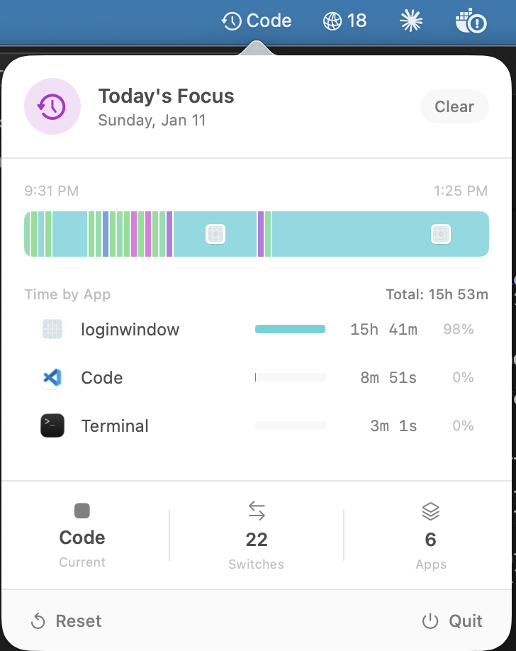

# AppTrail

A macOS menu bar app that tracks application switches throughout the day with a visual timeline.

## Features

- Visual timeline bar showing app usage throughout the day
- Aggregated time per app with percentages
- Click any app in the timeline to switch back to it
- Tracks total time and switch count
- Menu bar shows current app name

## Requirements

- macOS 14.0 (Sonoma) or later
- XcodeGen (`brew install xcodegen`)

## Installation

### With Claude

Open this repo in Claude Code and ask:

> Install this app on my Mac

Claude will check your system, build the app, and install it to Applications.

### Manual

1. Install XcodeGen: `brew install xcodegen`
2. Generate project: `xcodegen generate`
3. Build: `xcodebuild -scheme AppTrail -configuration Release build`
4. Copy to Applications: `cp -r ~/Library/Developer/Xcode/DerivedData/AppTrail-*/Build/Products/Release/AppTrail.app /Applications/`
5. Launch: `open /Applications/AppTrail.app`

## How It Works

Listens to `NSWorkspace.didActivateApplicationNotification` to detect app switches. Each switch is recorded as a timeline segment with start/end times, which are then visualized as colored blocks proportional to time spent.

## License

MIT
